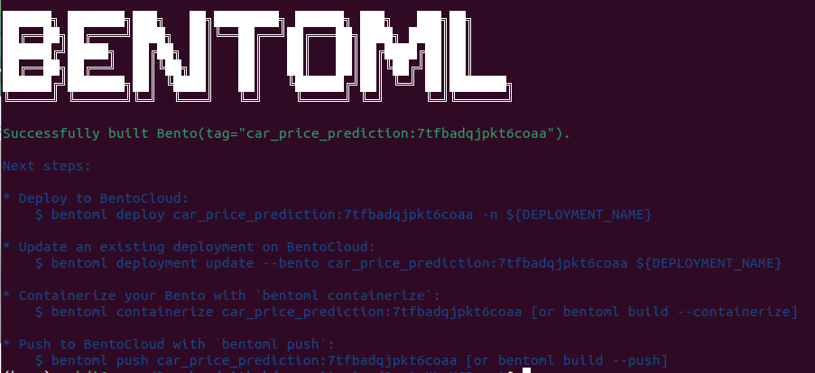

# Serving and Deploying Machine Learning Models with BentoML

In this repository, I explore BentoML, an open-source platform for packaging ML models. BentoML provides a straightforward approach for packaging trained models and their associated code and dependencies into a unified distribution format called "Bento". This platform supports various deployment options, including serving models as REST APIs, Docker containers, and batch jobs. 

This project focuses on predicting car prices in Germany as a case study. To accomplish this, I use the [Germany Cars Dataset](https://www.kaggle.com/datasets/ander289386/cars-germany). In the [this](https://medium.com/@mohsenim/tracking-machine-learning-experiments-with-mlflow-and-dockerizing-trained-models-germany-car-price-e539303b6f97) post and [this](https://github.com/mohsenim/MLflow-XGBoost-Docker) GitHub repository, I discussed how the dataset was preprocessed and cleaned. We establish a pipeline comprising a preprocessing stage for data preparation, followed by the implementation of an XGBoost model. It's worth noting that alternative models can be seamlessly integrated. XGBoost was selected as an emxaple and for its efficiency and widespread popularity as a machine learning ensemble algorithm. BentoML is used to serve the model and containerize it as a docker image.


### Install Dependencies
Ensure you have installed the necessary libraries by running:
```
pip install -r requirements.txt
```

## Running the Experiment Using XGBoost
To train a model, run the following command:
```
python train.py
```

Upon completion of the run, the code prints the following results:

```

    Trained! Mean squared error (MSE) of the model: 0.003412174771345764
    Model german_car_model.pkl is saved in: 'artifacts'.
```

## Serve the Model

`service.py` serves the trained model as REST APIs. The following command makes the service accessible at the address `http://127.0.0.1:3000/predict`:
```
bentoml serve service:CarPricePrediction
```

To test the model, requests can be sent to the REST API using the curl command:
```
curl -X 'POST' \
  'http://127.0.0.1:3000/predict' \
  -H 'accept: application/json' \
  -H 'Content-Type: application/json' \
  -d '{
  "input_records": [
    {"make":"Skoda", "model": "Fabia", "fuel": "Gasoline" ,"gear": "Automatic", "offerType": "Used","mileage_log": 1.929419,"hp": 95.0 ,"age": 0.0}
  ]
}'
```

which returns the following result:
```
[4.235708236694336]
```

As the model is trained to predict the logarithm of price, the output is in logarithmic scale and should be converted back using `10**prediction`.

## Build the Bento and Deploy the Model as s Docker Image

We can build the Bento by runing:
```
bentoml build
```



After building the Bento, a docker image can be created from the Bento:
```
bentoml containerize service:CarPricePrediction
```


## Running the Docker Image

The above command creates a docker image like `car_price_prediction:7tfbadqjpkt6coaa`. The image can later be run locally, on a server, or on a cloud. To run the docker image locally, you can use this command:
```
docker run --rm -p 3000:3000 car_price_prediction:7tfbadqjpkt6coaa
```

For a more detailed explanation of the code, refer to the accompanying Jupyter notebook file, `bentoml-deploy-docker.ipynb`.
